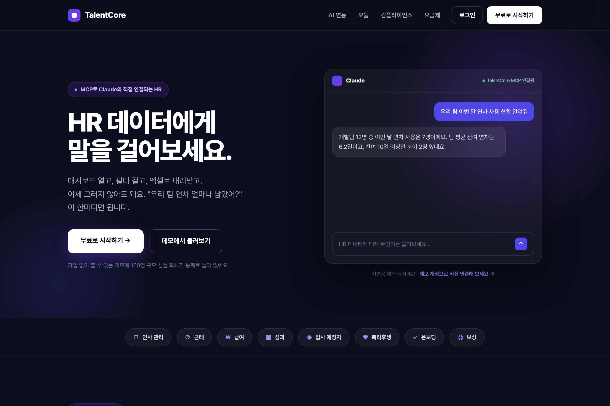
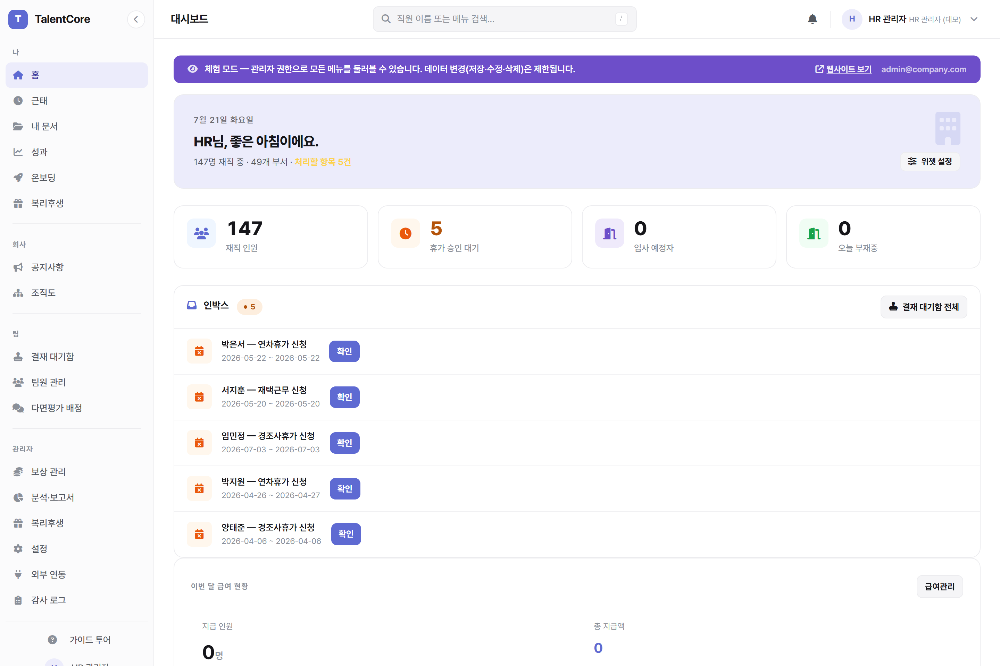
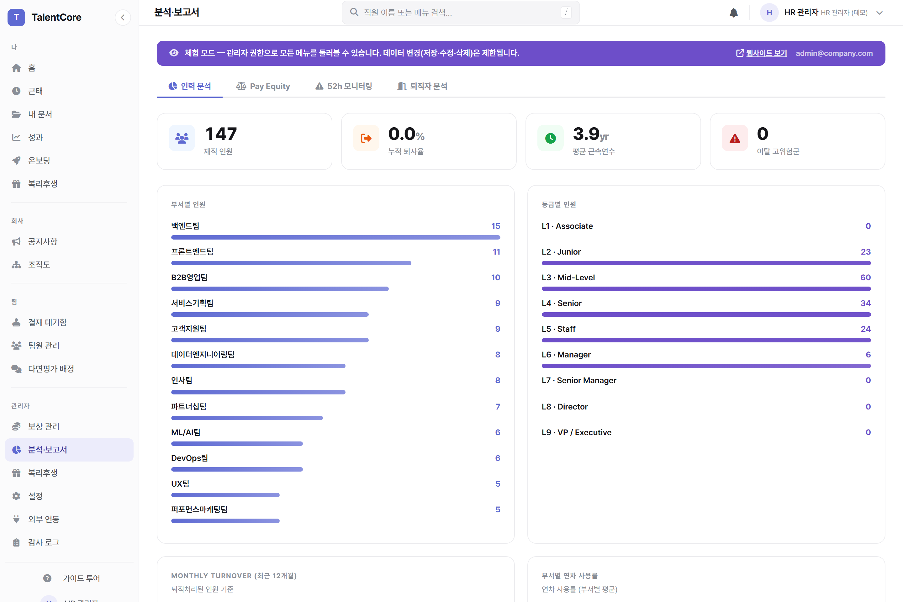
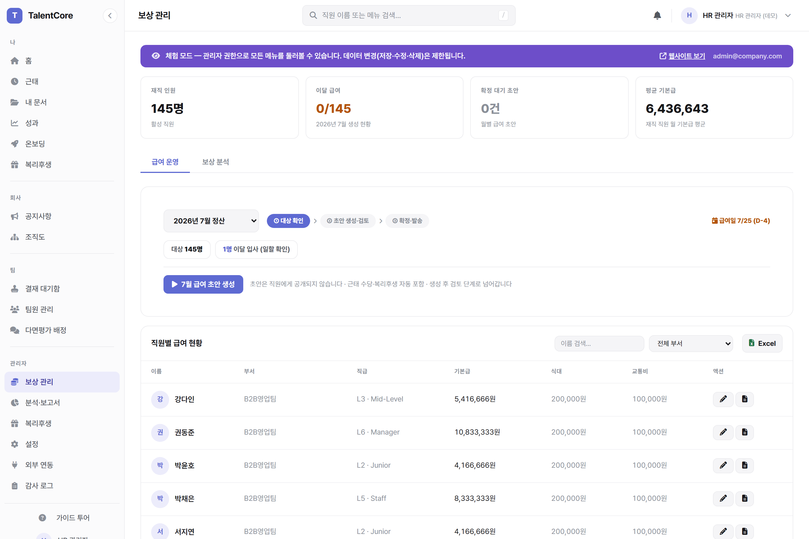
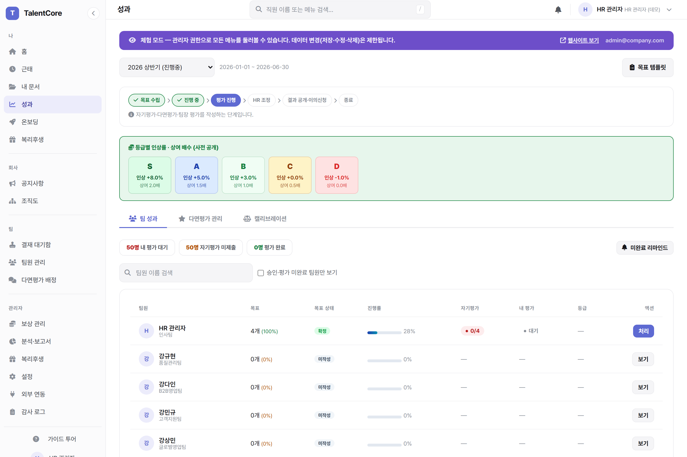
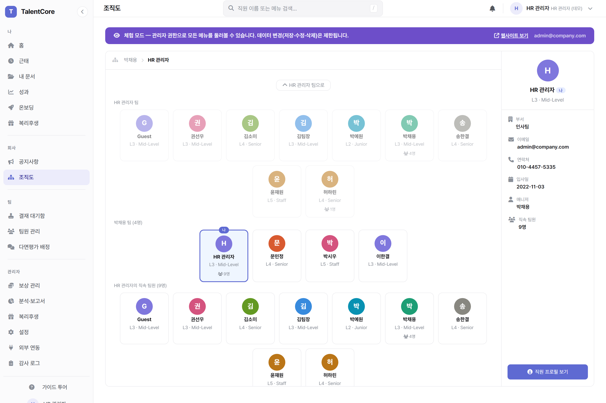
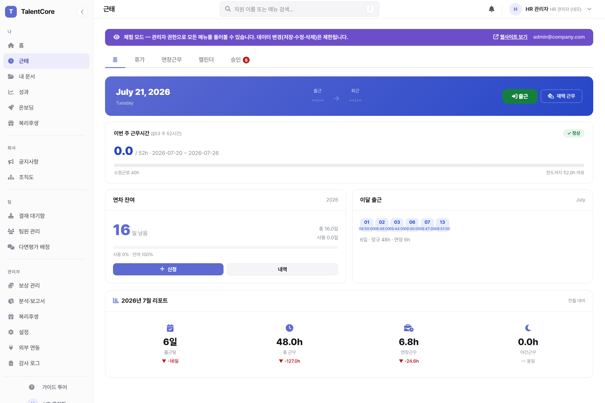

# TalentCore — AI-Native HR Platform

> **HR 데이터에게 말을 걸어보세요.**
> MCP로 Claude와 직접 연결되는 근로기준법 준수 HR 플랫폼
> Flask + SQLite · 비전공자 HR 주니어가 Claude Code로 단독 개발



---

## 라이브 데모

| | |
|---|---|
| **URL** | **https://talentcore.duckdns.org** |
| **체험 방법** | 랜딩에서 **[데모 보기]** 클릭 → 관리자 권한으로 즉시 로그인 |
| **범위** | 모든 화면 열람 가능 · 데이터 저장/수정은 차단(읽기 전용) · 재접속마다 세션 초기화 |

> 별도 가입 없이 HR Admin 권한의 모든 화면을 둘러볼 수 있습니다. 약 150명 규모의 샘플 회사 데이터가 통째로 들어 있습니다.

---

## 스크린샷

| | |
|:---:|:---:|
|  |  |
| **대시보드** — 인박스·재직 통계·이달 급여 | **People Analytics** — Headcount·Pay Equity·이직률 |
|  |  |
| **보상 관리** — 급여 정산 보드·밴드·Compa-Ratio | **성과 관리** — 목표 승인·다면평가·캘리브레이션 |
|  |  |
| **조직도** — 리포팅 라인·인물 상세 패널 | **근태** — 체크인/아웃·주 52시간 감시·휴가 |

---

## 차별점 — Claude MCP 연동

TalentCore는 **Model Context Protocol(MCP) 서버**를 내장합니다. Claude Desktop에 연결하면, 대시보드를 열지 않고도 자연어로 HR 데이터를 물어볼 수 있습니다.

```
"우리 팀 이번 달 연차 사용 현황 알려줘"
"내가 처리할 결재 뭐 남았어?"
"부서별 인원 현황 정리해줘"
```

- **조회 전용(read-only) 8개 도구** — 내 연차 잔액 · 내 급여명세 · 팀 근태 · 팀 인원 · 승인 대기 · 성과 현황 · 온보딩 현황 · 직원 검색
- **역할 기반 스코프** — 접속 계정의 권한(관리자/매니저/직원)에 따라 조회 범위가 자동 제한됩니다. 화면에서 볼 수 없는 데이터는 AI도 답하지 않습니다.
- 쓰기·실행 도구는 제공하지 않습니다. AI는 데이터를 **읽어서 정리**할 뿐, 변경하지 않습니다.

> 랜딩 히어로의 채팅은 위 동작을 보여주는 시연용 예시입니다.

---

## 근로기준법 준수 자동화

인사담당자 한 명이 챙기기 어려운 법정 의무를 기본 동작으로 처리합니다.

| 근거 | 자동화 |
|---|---|
| §50 · §53 | 주 52시간 실시간 계산 → 위반 전 본인·매니저·HR 경고 |
| §54 · §56 | 법정 휴게시간 자동 공제 + 연장·야간·휴일 수당 가산 자동 계산 |
| §60 · §61 | 연차 자동 발생·이월 + 연차사용촉진 발송 이력(법적 증빙) |
| §48 | 급여 확정 시 명세서 자동 공개 + 이메일 발송(교부 의무) |
| 최저임금법 · 퇴직급여법 | 최저임금 미달 경고 · 퇴직금/미사용 연차수당 자동 정산 |
| 기록 의무 | 민감정보 열람 · 급여 변경 · 데이터 내보내기 감사 로그 |

> 급여·세액 계산 결과는 참고용 자동 계산이며, 최종 확정은 담당자 검토를 거칩니다.

---

## 주요 기능

### 인사 관리 (HCM)
- 직원 프로필 — 기본정보 / 인사정보 / 급여 / 근태 / 성과 / 스킬 탭
- 사번 자동 생성 · 부서 계층(부문 → 본부 → 실 → 팀) · 직급 CL1~CL9 + IC/M 트랙
- 인사발령 이력 + 미래 발령 예약(발령일 자동 반영)
- 조직도 — 매니저 기반 리포팅 라인, 슬라이드 패널
- 스킬 & 자격증(레벨 4단계·만료 알림) · 직원 문서함(본인·직속매니저·HR만 접근)
- 입사 예정자 관리 — 직접 입력 / CSV / 표준 웹훅(외부 ATS 연동) → 원클릭 직원 전환
- CSV 일괄 임포트 + 왕복 수정(내보내기 → 편집 → 재업로드 일괄 반영)
- 퇴직 마법사 3단계 + 퇴직금 자동 계산

### 근태 관리
- 체크인/아웃(출결 자동 판정) · 근무 스케줄(고정/선택/재량/단축)
- 휴가 13종 + 이월 · 연장·야간·휴일 수당 자동 계산
- 주 52시간 실시간 감시 · 법정 휴게시간 자동 공제
- 유연근무 스케줄러(시간×요일 블록) · OT 사전/사후 승인 워크플로우

### 급여·보상 관리
- 급여명세서 자동 생성(4대보험 + 소득세) · 비과세 항목 자동 처리
- **급여 초안 → 확정 2단계**(확정 시에만 직원 공개·이메일 발송)
- 급여 밴드(Min/Mid/Max) + Compa-Ratio 슬라이더 · Merit Matrix
- 연봉 조정 3단계(조정안 → 시뮬레이션 → 적용일 반영) · ACR 워크플로우
- 인건비 추이 + 직원 기본급 타임라인 · 복지포인트 · Total Compensation

### 성과 관리
- 주기 상태머신(목표 → 진행 → 평가 → 캘리브레이션 → 이의 → 종료)
- 목표 승인 워크플로우(제출 → 확정/반려, 가중치 합 100% 검증)
- 다면평가 — Start/Stop/Continue + 익명성 임계값(응답 3명 미만 비공개)
- 캘리브레이션 팀 단위(분포 바 + Potential 게이팅) · 최대 1단계 하향·사유 필수
- 9박스 · Talent Card(Flight Risk 자동 감지) · 후계자 계획 · 등급 이의제기

### 채용 (ATS) · *Enterprise*
- 채용 요청서 3단계 승인 → 공고 자동 생성 · 칸반 파이프라인(드래그앤드롭)
- 면접 라운드·인터뷰어 배정·피드백 · 불합격 사유 코드(컴플라이언스)
- 오퍼 레터(기본급/성과급/RSU·스톡옵션/사이닝) · 수락 시 직원 자동 생성 + 온보딩 가동
- 채용 대시보드(퍼널 / Time-to-Fill / 소스별 합격률)

### 온보딩 자동화 · 외부 연동
오퍼 수락 또는 직원 등록 시 자동 실행(설정된 연동에 한해):
- 온보딩 체크리스트 생성 · 웰컴 이메일(Day 1 일정 + 버디 소개)
- Jira 온보딩 에픽 + 부서별 태스크 · 버디 배정(양방향 Slack DM)
- Slack 실시간 알림(급여명세·휴가 승인/반려·인사발령·오퍼·퇴직 등)

> 외부 연동(Slack/Jira/Confluence/SMTP)은 `.env` 설정 시 활성화되며, 미설정 시 Demo 모드로 동작합니다.

### 증명서 & 보고서
- 재직/경력/퇴직/근로소득 원천징수영수증 발급 · Excel 내보내기
- People Analytics(Headcount / 이직률 / Pay Equity / Compa-Ratio)
- HR 데이터 마법사(소스 선택 → 테이블 / 차트 / 피벗 / 통계)

---

## 요금제 (3계층)

| | Core | Growth | Enterprise |
|---|---|---|---|
| 핵심 | 근로기준법 준수 자동화 | + 성과·온보딩·복리후생 | + 채용 ATS·정교한 인재 전략 |
| 대표 기능 | 인사·근태·급여·증명서·감사로그 | 성과관리·입사예정자·복지포인트 | 캘리브레이션 9박스·급여밴드·후계자계획 |

> 현재 **무료 파트너 프로그램**으로 운영 중입니다(`BILLING_ENABLED=0`). 결제 기능은 환경변수로 비활성화되어 있습니다.

---

## 기술 스택

| 항목 | 내용 |
|---|---|
| Backend | Python 3.12+ · Flask 3.1 |
| Database | SQLite (sqlite3 직접 쿼리, ORM 없음) · 테넌트별 DB 격리 |
| Frontend | HTML · Vanilla JS · 커스텀 CSS(Pretendard) — 외부 UI 라이브러리 없음 |
| AI 연동 | MCP 서버(read-only, 역할 스코프) — Claude Desktop 연결 |
| 외부 연동 | Slack Bot API · Jira / Confluence REST · SMTP |
| 배포 | Oracle Cloud VM · Nginx + Gunicorn · Let's Encrypt HTTPS · DuckDNS 도메인 |
| 인증·보안 | Session 기반 역할별 접근제어 · CSRF 전면 적용 · 감사 로그 · 일일 자동 백업 |

---

## 역할별 권한

| 역할 | 접근 범위 |
|---|---|
| **HR Admin** | 전체 기능 |
| **Manager** | 담당 팀원 근태 승인 · 성과 평가 · 결재 |
| **Employee** | 본인 정보 조회 · 근태 신청 · 급여명세 · 증명서 |
| **Recruiter** | 채용 공고 · 지원자 · 면접 · 오퍼 |

---

## 로컬 실행

```bash
git clone https://github.com/Humgut1/hr-system.git
cd hr-system
pip install -r requirements.txt
python migrate_db.py   # DB 초기화 + 시드 데이터 (직원 147명)
python run.py          # → http://localhost:5000
```

### 환경변수 (선택)

`.env` 파일 생성 시 외부 연동 활성화. 없으면 Demo 모드로 동작합니다.

```env
# 세션 시크릿 (운영 필수)
HR_SECRET_KEY=...

# Slack
SLACK_BOT_TOKEN=xoxb-...
SLACK_SIGNING_SECRET=...

# Jira / Confluence
JIRA_EMAIL=your@email.com
JIRA_API_TOKEN=...
JIRA_BASE_URL=https://yoursite.atlassian.net
CONFLUENCE_BASE_URL=https://yoursite.atlassian.net/wiki

# SMTP (웰컴 이메일 · 급여명세 발송)
SMTP_HOST=smtp.gmail.com
SMTP_PORT=587
SMTP_USER=your@email.com
SMTP_PASSWORD=...

# 결제 (기본 비활성)
BILLING_ENABLED=0
```

### MCP 서버 연결 (선택)

Claude Desktop 설정에 아래를 추가하면 자연어 조회가 활성화됩니다:

```json
{
  "mcpServers": {
    "talentcore": {
      "command": "python",
      "args": ["mcp_server.py"],
      "env": { "TALENTCORE_USER_EMAIL": "admin@company.com" }
    }
  }
}
```

---

## 시드 데이터

`python migrate_db.py` 실행 시 자동 생성:

- 직원 147명 (부서 다수 · 직급 9단계 · 직군 23종)
- 급여명세서 6개월치 (4대보험 실계산) · 근태 기록 다수
- 성과 주기 + 목표·리뷰 · 휴가 신청 · 채용 공고 + 지원자 · 전자계약

---

## 개발 배경

비전공자 HR 주니어가 Claude Code를 활용해 단독으로 개발했습니다. 글로벌 HRIS 제품들을 레퍼런스로 삼아, 국내 근로기준법 준수를 핵심 축으로 실무에서 쓸 수 있는 수준을 목표로 설계했습니다.

---

## License

MIT — 자유롭게 자체 호스팅·수정할 수 있습니다.
개인정보처리방침(`/privacy`)·이용약관(`/terms`)은 **운영 인스턴스 기준** 문서이며, 자체 호스팅 시 운영자가 직접 작성해야 합니다.
